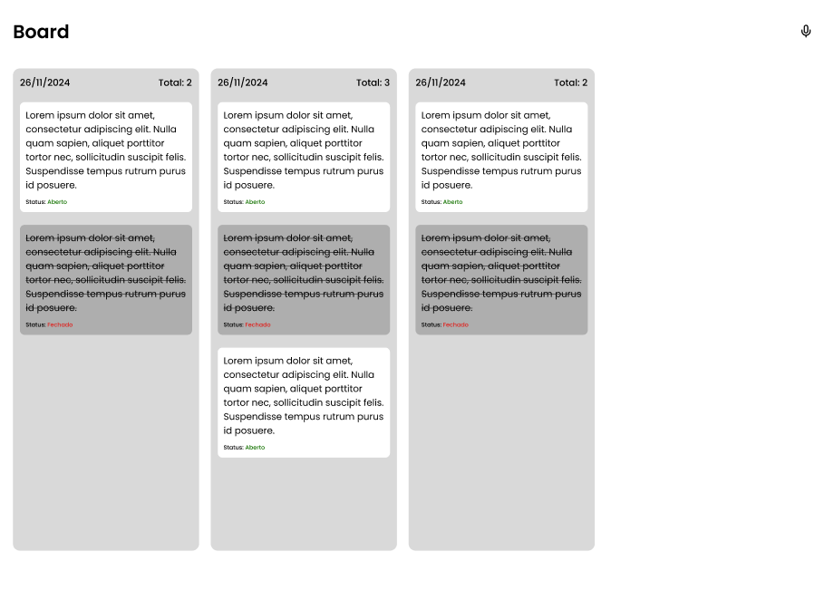

  

# Assistente Virtual

This is the virtual assistant that helps you organize your task board. With it, you can use the following voice commands:
- Create task: "criar atividade {task_name}"
- Complete task: "concluir atividade {task_name}"
- Delete task: "deletar atividade {task_name}"
- Update task: "atualizar atividade {task_name} para atividade {new_task_name}"

Just say the command corresponding to the action you want to perform!

## Tech Stack

## Getting Started

1. **Install Dependencies**: `pip install -r requirements.txt`

## Contribute

1. **Clone project**: `git clone https://github.com/Alvaro-18/Projeto-Assistente-Virtual.git`
2. **Create feature/branch**: `git checkout -b feature/NAME`

## License

This software is available under the following licenses:

- [MIT](https://rem.mit-license.org)
